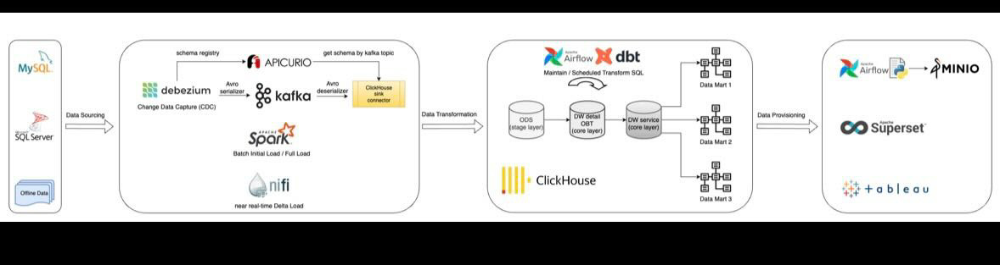

# CDC Data-Pipeline

## Concept
To overcome data incorrectness and inconsistency issue when doing data report, developing this Change Data Capture (CDC) system to make sure the data in data warehouse is available.

### Data Sourcing
Use `Debezium` to capture any row-level CRUD operations in databases, and then the data is streamed into data warehouses.

Where
+ Data Sources:
    - `MySQL`
    - `SQL Server`
+ Data Warehouse:
    - `ClickHouse`

The CDC data is consumed from `Kafka` into `ClickHouse` via `clickhouse-kafka-connect`.

To reduced network congestion and faster data transmission times, the CDC data is serialized from `JSON` to `Avro`. Before CDC data consumed, these data will be deserialized where its schema is registered on `Apicurio`.

### Data Transformation
Avoid always hardcoding SQL code, use `dbt` tool to do data transformation. This process is more secure and easily to maintain.

## Run
```bash
make all
```

## Diagram

